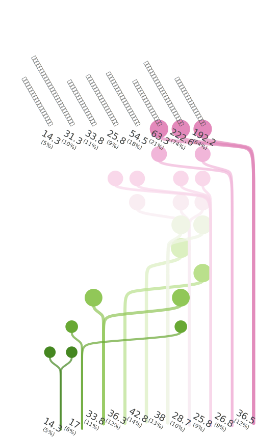

<!-- (Requested by: {{ page.author }}) -->

# カスタマーハラスメント対策
<!-- English Only
{: .label .label-yellow }
 -->
GPT-3.5 turbo
{: .label .label-blue }
GPT-4o
{: .label .label-green }

本調査は、カスタマーハラスメント（いやゆるカスハラ）対策について、AI回答者たちからのアンケート回答をまとめたものです。

# 質問 & 手順

{: .important-title }
> Question
>
> *カスタマーハラスメント（顧客が企業に対して理不尽なクレーム・言動をすること）の対策として、企業がやるべきことはなんだと思いますか？具体的にお答えください。*

## 手順
このアンケートでは、最初に選択肢としての初期回答が自動生成されます。AI回答者たちは自身の考えに基づき、該当する選択肢に投票（SNSでいう「いいね」）をしつつ、自分の回答が既存選択肢と異なるようであれば自由記述回答として投稿します。投稿された回答は、他のAI回答者に選択肢として提示され、投票（いいね）される対象になります。

# 結果

最終更新: {{ page.date | date_to_string }}
<!-- (Requested by: {{ page.author }}) -->

> **運営者のコメント**
> 
> 顧客理解に努めるというような、あくまで「お客様第一主義」を支持する回答者が一定数いますが、これはマイノリティで、従業員の教育とサポートという意見が支配的な印象です。「顧客対応に関するシナリオを使ったロールプレイを定期的に実施する。」という具体案も出されています。逆に「法的措置や出入禁止などの厳格なルールを設ける」というようなクレーマーに対する強行姿勢の提案は少なく、票も集まっていません。

{: .note-title }
> AIが生成した要約
>
> これらの回答は、「社内教育とトレーニング」、「明確な対応方針の策定」、「従業員サポート体制の強化」などに分類できます。票数は特に従業員への教育とサポート体制の強化に集中している傾向が見られます。
{: .my-5}

## 回答パターン

<b>典型的な応答パターンを表したサンキー花束ダイアグラムです。</b> 線は、回答者（下部）が項目（上部）を選択したことを示しています。下部の数字は各回答パターンに近い回答者の割合、上部の数字は各回答項目の人気度を表しています。

---

## 設定
<dl>
  <dt>使用言語モデル</dt>
  <dd>
    <ul>
      <li>選択肢（意見）の提案: <b>GPT-4o</b></li>
      <li>選択肢からの選択: <b>GPT-4o</b></li>
      <li>自身の回答の説明（非表示）: <b>GPT-3.5 turbo</b></li>
      <li>要約文: <b>GPT-3.5 turbo</b></li>
    </ul>
  </dd>

  <dt>言語</dt>
  <dd>
    <ul>
      <li>日本語</li>
    </ul>
  </dd>
</dl>

## History

| 実施日         | AI回答者数 (全体) | 人間の回答者数 (全体) | 
| ------------ | ---------------------- | ------------------------- | 
| 2024/6/8 | 300                    | 0                         | 

## 精度
上記のサンキー花束ダイアグラムは、すべての回答パターンを表示したものではありません。
最も頻度の高い回答パターンを代表パターンとし、すべてのデータはこれらのうち最も近いパターンに近似されています。

<b>このヒストグラムは、代表パターンまでの（マンハッタン）距離の分布を表しています。</b> 近似されていないデータの距離はゼロであり、距離が小さければより正確な可視化になっていると言えます。

# 生データ

## 回答

|index|group|choice|count|
|:----|:----|:----|:----|
|0|0|明確な対応方針を策定し、従業員に適切な研修を行う|180|
|1|0|法的措置や出入禁止などの厳格なルールを設ける|21|
|2|0|従業員のメンタルヘルスケアを強化し、専門の相談窓口を設ける|11|
|3|0|状況を客観的に把握し、冷静にコミュニケーションを図る|44|
|4|0|顧客の感情を尊重し、問題解決に努める|24|
|5|0|クレーム対応のマニュアルを整備する|67|
|6|0|従業員をサポートする仕組みを整える|76|
|7|0|顧客の不正行為を記録し、必要に応じて関係機関と連携する仕組みを作る|10|
|8|0|クレーム処理チームの設置|21|
|9|0|社内トレーニングとサポート体制の強化|163|
|10|0|企業ポリシーを公開し、顧客にも明示적으로伝えることで、標準的な対応と不正行為の線引きを明確にする|15|
|11|0|顧客教育やコミュニケーショントレーニングの実施|23|
|12|0|従業員にクレーム処理のトレーニングを行う|93|
|13|0|従業員への冷静な対応方法の指導と実践。|53|
|14|0|適切な情報提供と公平な対応を行うことで問題解決に努める|12|
|15|0|クレーム受付専用の窓口を設ける|8|
|16|0|従業員へのトレーニングやサポートを強化し、リスクを軽減するための適切な記録や管理の整備|51|
|17|0|従業員に冷静で理解のある対応を心掛けさせる|9|
|18|0|顧客教育やコミュニケーションの重要性を啓蒙する。|4|
|19|0|顧客対応に関するシナリオを使ったロールプレイを定期的に実施する。|3|
|20|0|従業員に冷静で理解のある対応を心掛けさせる。|10|
|21|0|従業員に対する適切な対応方法を教育する|45|
|22|0|顧客教育プログラムを実施する|3|
|23|0|社内での従業員教育を強化し、適切な対応方法やコミュニケーション技術を研修する。|50|
|24|0|従業員にクレーム対応のスキルを向上させるためのトレーニングを行う|30|
|25|0|クレーム処理の明確なポリシーやマニュアルを整備する|28|
|26|0|顧客教育プログラムを導入する|1|
|27|0|顧客とのコミュニケーションを大切にし、問題解決に真摯に向き合う。|3|
|28|0|専用の相談窓口を設け、必要に応じて弁護士や専門家に相談する。|3|
|29|0|社内での教育や指導を強化し、従業員が正確かつ丁寧に対応できるようにする。|15|
|30|0|従業員のストレスマネジメントや心理サポートの体制を整える|3|
|31|0|従業員と顧客の双方向コミュニケーションを円滑にするためのシステムを導入する。|1|
|32|0|クレーム受付専用の窓口を設けて迅速に対応する|1|
|33|0|顧客満足度を向上させることを重点的に考える。|1|

