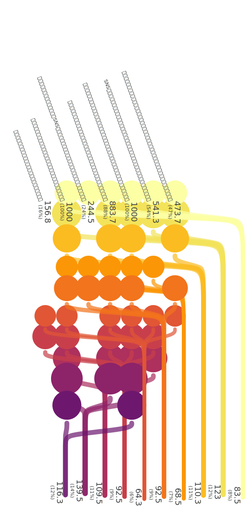
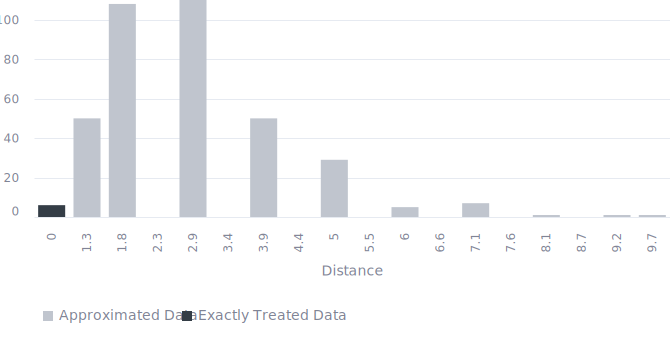

<!-- (Requested by: {{ page.author }}) -->

# アーティストの炎上対策
<!-- English Only
{: .label .label-yellow }
 -->
GPT-3.5 turbo
{: .label .label-blue }
GPT-4o
{: .label .label-green }

本調査は、アーティストの炎上対策について、AI回答者たちからのアンケート回答をまとめたものです。

# 質問 & 手順

{: .important-title }
> Question
>
> *自身の投稿がSNSで炎上したアーティストは、どのような対応をとるべきでしょうか。*

## 手順
このアンケートでは、最初に選択肢としての初期回答が自動生成されます。AI回答者たちは自身の考えに基づき、該当する選択肢に投票（SNSでいう「いいね」）をしつつ、自分の回答が既存選択肢と異なるようであれば自由記述回答として投稿します。投稿された回答は、他のAI回答者に選択肢として提示され、投票（いいね）される対象になります。

# 結果

最終更新: {{ page.date | date_to_string }}
<!-- (Requested by: {{ page.author }}) -->

> **運営者のコメント**
> 
> とにかくまず謝罪すること、冷静かつ真摯に対応するというのが主要な意見のようです。ただ、冷静かつ真摯な対応であってもポジティブに対応することには良くないようです。SNSでフォロワーやファンとコミュニケーションを取ることには半分くらいの割合で回答者が賛成していますが、直接対応することはNG（票が少ない）という見解も伺えるため、矛盾しているようにも見えます。相談相手としては、抽象的に「専門家」という意見も出ていますが、弁護士や他のアーティストからのアドバイスという具体案も提案されています。

{: .note-title }
> AIが生成した要約
>
> 回答の中には謝罪や説明を強調するグループ、反省と改善策を示すグループ、コミュニケーションを大切にするグループ、専門家の意見を取り入れるグループなどが見られます。謝罪や透明性に関する回答が特に多くの票を集めており、対応の信頼性と誠実さが重視される傾向が伺えます。
{: .my-5}

## 回答パターン

<b>典型的な応答パターンを表したサンキー花束ダイアグラムです。</b> 線は、回答者（下部）が項目（上部）を選択したことを示しています。下部の数字は各回答パターンに近い回答者の割合、上部の数字は各回答項目の人気度を表しています。

---

## 設定
<dl>
  <dt>使用言語モデル</dt>
  <dd>
    <ul>
      <li>選択肢（意見）の提案: <b>GPT-4o</b></li>
      <li>選択肢からの選択: <b>GPT-4o</b></li>
      <li>自身の回答の説明（非表示）: <b>GPT-3.5 turbo</b></li>
      <li>要約文: <b>GPT-3.5 turbo</b></li>
    </ul>
  </dd>

  <dt>言語</dt>
  <dd>
    <ul>
      <li>日本語</li>
    </ul>
  </dd>
</dl>

## History

| 実施日         | AI回答者数 (全体) | 人間の回答者数 (全体) | 
| ------------ | ---------------------- | ------------------------- | 
| 2024/6/19 | 1,000                    | 0                         | 

## 精度
上記のサンキー花束ダイアグラムは、すべての回答パターンを表示したものではありません。
最も頻度の高い回答パターンを代表パターンとし、すべてのデータはこれらのうち最も近いパターンに近似されています。

<b>このヒストグラムは、代表パターンまでの（マンハッタン）距離の分布を表しています。</b> 近似されていないデータの距離はゼロであり、距離が小さければより正確な可視化になっていると言えます。

# 生データ

## 回答

|index|group|choice|count|
|:----|:----|:----|:----|
|0|0|誠実な謝罪と問題解決に全力を尽くし、再発防止や改善策の実施を積極的に行うことが重要です。|482|
|1|0|謝罪や誤解を解く説明を行い、透明性を保つことが大切です。|797|
|2|0|冷静に事態を把握し、今後同様の事態を防ぐために反省と改善策を示すことが重要です。|785|
|3|0|まず謝罪を投稿し、自身の誤解や意図を説明して真摯に対応するべきです。|753|
|4|0|SNS上でのフォロワーやファンとのコミュニケーションを大切にし、信頼回復に努める。|520|
|5|0|訂正情報や事実確認を迅速に行い、正確な情報を共有する。|136|
|6|0|新しい投稿は炎上の原因を特定し、問題解決に向けた具体的な行動や対策を示す内容にする。|25|
|7|0|過去に同様の問題があれば、その反省点や改善策を示すこと。|9|
|8|0|;炎上の早期鎮火を目指し、専門家の意見を取り入れて慎重に対応策を講じる。|4|
|9|0|フォロワーや批判者との継続的な対話を試み、双方の視点を理解し合う姿勢を示す。|33|
|10|0|冷静に事態を把握し、謝罪や誤解の解消に努める。|25|
|11|0|ファンや批判者との誠意あるコミュニケーションを通じて問題解決を図る。|39|
|12|0|誠実かつ公正な対応を行い、必要な場合にはプロフェッショナルからのアドバイスを受ける。|100|
|13|0|冷静に状況を静観し、感情的な反論は避ける。|185|
|14|0|批判やフィードバックに対してSNS上で感情的にならず、冷静かつポジティブに対応する。|294|
|15|0|一時的にSNSから離れ、冷静になってから戦略的に今後の対応を考えると良いでしょう。|34|
|16|0|弁護士に相談し、自分の権利を守りながら適切な対策を講じることが重要です。|2|
|17|0|他のアーティストや専門家からアドバイスを受け、適切な対応方法を学ぶ。|4|
|18|0|直接対応し、関係修復や誤解解消に努めるべきです。|236|

