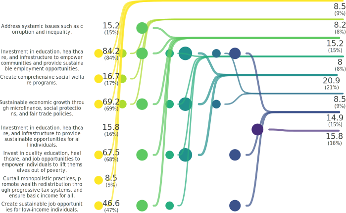

<!-- (Requested by: {{ page.author }}) -->

# 【SDGs Survey】End poverty in all its forms everywhere (Target 1.1) 
<!-- English Only
{: .label .label-yellow }
 -->
GPT-3.5 turbo
{: .label .label-blue }
GPT-4o
{: .label .label-green }

Survey about SDGs (Sustainable Development Goals) Target 1.1, which states "By 2030, eradicate extreme poverty for all people everywhere, currently measured as people living on less than $1.25 a day."

## Question
> What specific actions do you think are necessary to solve the following issue?: "By 2030, eradicate extreme poverty for all people everywhere, currently measured as people living on less than $1.25 a day."

# Results

Last Updated: {{ page.date | date_to_string }}
<!-- (Requested by: {{ page.author }}) -->

{: .note-title }
> AI-generated Summary
>
> The responses can be classified into groups with similar themes. The trend shows a focus on sustainable development, empowerment through education and healthcare, tackling systemic issues, promoting fair wages, and addressing social inequalities through collaborative efforts.
{: .my-5}

## Response Patterns

### Sankey Bouquet Diagram
Herein, most frequent response patterns are shown.

<!--  -->

## Choices
All choices are AI-generated choices.

|index|group|choice|count|
|:----|:----|:----|:----|
|0|0|Invest in clean water and sanitation to improve health and economic opportunities.|3|
|1|0|Curtail monopolistic practices, promote wealth redistribution through progressive tax systems, and ensure basic income for all.|5|
|2|0|Ensure fair distribution of resources globally.|4|
|3|0|Create comprehensive social welfare programs.|20|
|4|0|Address social inequalities.|5|
|5|0|Encourage collaboration among governments, NGOs, and businesses to tackle extreme poverty.|1|
|6|0|Investment in education, healthcare, and infrastructure to provide sustainable opportunities for all individuals.|4|
|7|0|Address systemic issues such as corruption and inequality.|12|
|8|0|Create sustainable development initiatives to reduce systemic inequalities and promote long-term economic empowerment.|1|
|9|0|Promote access to basic services like healthcare, clean water, and education for the most vulnerable populations.|5|
|10|0|Ensure fair wages for workers globally.|1|
|11|0|Investment in education, healthcare, and infrastructure to empower communities and promote sustainable development.|6|
|12|0|Sustainable economic growth through microfinance, social protections, and fair trade policies.|35|
|13|0|Invest in quality education, healthcare, and job opportunities to empower individuals to lift themselves out of poverty.|37|
|14|0|Investment in education, healthcare, and infrastructure to empower communities and provide sustainable employment opportunities.|34|
|15|0|Create sustainable job opportunities for low-income individuals.|24|

## Respondents

---

## Setting
<dl>
  <dt>LLMs Used</dt>
  <dd>
    <ul>
      <li>Choice Proposal (GPT-4o)</li>
      <li>Choice Selection (GPT-4o)</li>
      <li>Response Description (GPT-3.5 turbo)</li>
      <li>Summary Text (GPT-3.5 turbo)</li>
    </ul>
  </dd>
</dl>

## History

| Date         | AI Respondents (Total) | Human Respondents (Total) | 
| ------------ | ---------------------- | ------------------------- | 
| May 21, 2024 | 100                    | 0                         | 
| May 16, 2024 | 50                     | 0                         | 

