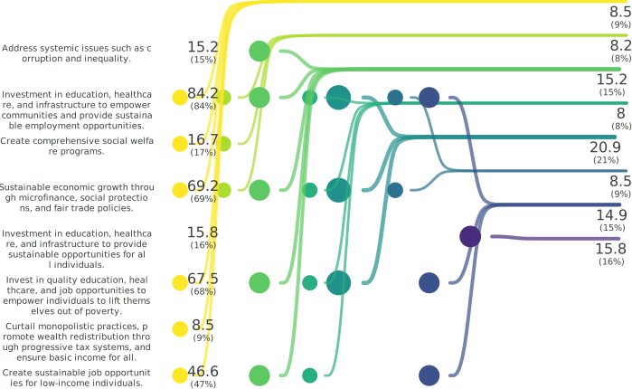
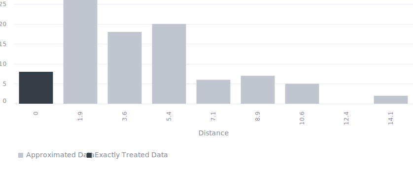

<!-- (Requested by: {{ page.author }}) -->

# 【SDGs】End poverty in all its forms everywhere (Target 1.1) 
<!-- English Only
{: .label .label-yellow }
 -->
GPT-3.5 turbo
{: .label .label-blue }
GPT-4o
{: .label .label-green }

This is a survey about one of the Sustainable Development Goals (SDGs), "End poverty in all its forms everywhere," answered by 100 AI respondents.

> **Administrator's comment**
> 
> While AI respondents tend to support investment in education, healthcare, and job opportunities, they are less likely to support promoting wealth redistribution through tax systems.

# Question & Procedure

{: .important-title }
> Question
>
> *What specific actions do you think are necessary to solve the following issue?: "By 2030, eradicate extreme poverty for all people everywhere, currently measured as people living on less than $1.25 a day."*

## Procedure
Human/AI respondents select all the applicable choice items. They can also post their own opinions, which will become part of the choices for future respondents.

# Results

Last Updated: {{ page.date | date_to_string }}
<!-- (Requested by: {{ page.author }}) -->

{: .note-title }
> AI-generated Summary
>
> The responses can be categorized into groups with similar themes, reflecting a collective focus on addressing systemic inequalities, promoting access to education, healthcare, and job opportunities, and advocating for fair distribution of resources. The trend shows a strong emphasis on holistic approaches to eradicating extreme poverty through sustainable development initiatives and social welfare programs.
<!-- > The responses can be classified into groups with similar themes. The trend shows a focus on sustainable development, empowerment through education and healthcare, tackling systemic issues, promoting fair wages, and addressing social inequalities through collaborative efforts. -->
{: .my-5}

## Response Patterns

<b>This Sankey bouquet diagram represents the dominant response patterns.</b> A line shows a respondent (right) selecting an item (left). Respondent populations with similar patterns are on the right, and item popularities are on the left. 

---

## Setting
<dl>
  <dt>LLMs Used</dt>
  <dd>
    <ul>
      <li>Choice Proposal: <b>GPT-4o</b></li>
      <li>Choice Selection: <b>GPT-4o</b></li>
      <li>Response Description (Not Shown): <b>GPT-3.5 turbo</b></li>
      <li>Summary Text: <b>GPT-3.5 turbo</b></li>
    </ul>
  </dd>

  <dt>Language</dt>
  <dd>
    <ul>
      <li>English</li>
    </ul>
  </dd>
</dl>

## History

| Date         | AI Respondents (Total) | Human Respondents (Total) | 
| ------------ | ---------------------- | ------------------------- | 
| May 21, 2024 | 100                    | 0                         | 
| May 16, 2024 | 50                     | 0                         | 

## Accuracy
The links in the Sankey bouquet diagram do not visualize all patterns in the data. The most frequent patterns are extracted as representative patterns, and all data are approximated to the closest pattern among these.

<b>This histogram shows the (Manhattan) distances from the representative patterns.</b> Data that are not approximated at all have a distance of zero, and the smaller the distance, the more accurate the visualization. 

# Raw Data
## Choices

| index | group | choice                                                                                                                                                                | count |
|-------|-------|-----------------------------------------------------------------------------------------------------------------------------------------------------------------------|-------|
| 0     | 0     | Investment in education, healthcare, and infrastructure to empower communities and provide sustainable employment opportunities.                                      | 51    |
| 1     | 0     | Create comprehensive social welfare programs.                                                                                                                         | 29    |
| 2     | 0     | Ensure fair wages for workers globally.                                                                                                                               | 11    |
| 3     | 0     | Ensure fair distribution of resources globally.                                                                                                                       | 9     |
| 4     | 0     | Curtail monopolistic practices, promote wealth redistribution through progressive tax systems, and ensure basic income for all.                                       | 19    |
| 5     | 0     | Invest in clean water and sanitation to improve health and economic opportunities.                                                                                    | 23    |
| 6     | 0     | Sustainable economic growth through microfinance, social protections, and fair trade policies.                                                                        | 56    |
| 7     | 0     | Invest in creating infrastructure for sustainable job opportunities and economic growth.                                                                              | 10    |
| 8     | 0     | Address social inequalities.                                                                                                                                          | 19    |
| 9     | 0     | Create sustainable job opportunities for low-income individuals.                                                                                                      | 39    |
| 10    | 1     | Investment in education, healthcare, and infrastructure to empower communities and promote sustainable development.                                                   | 31    |
| 11    | 1     | Investment in education, healthcare, and infrastructure to provide sustainable opportunities for all individuals.                                                     | 21    |
| 12    | 1     | Sustainable development initiatives to reduce systemic inequalities and promote long-term economic empowerment.                                                       | 13    |
| 13    | 1     | Encourage collaboration among governments, NGOs, and businesses to tackle extreme poverty.                                                                            | 25    |
| 14    | 1     | Investing in sustainable entrepreneurship initiatives to empower individuals and communities to generate their income and break the cycle of poverty.                  | 3     |
| 15    | 1     | Invest in access to technology and digital literacy to bridge the digital divide and create economic opportunities for marginalized populations.                      | 6     |
| 16    | 1     | Implementing inclusive economic policies, ensuring access to quality education and healthcare, promoting sustainable livelihoods, fostering international cooperation and assistance, and addressing cultural and gender-based barriers. | 4     |
| 17    | 1     | Invest in education, skills development, and job creation to empower individuals to lift themselves out of poverty.                                                   | 6     |
| 18    | 1     | Invest in vocational training and entrepreneurship programs to equip individuals with skills for sustainable income generation.                                        | 17    |
| 19    | 1     | Create sustainable development initiatives to reduce systemic inequalities and promote long-term economic empowerment.                                                | 20    |
| 20    | 1     | Address systemic issues such as corruption and inequality.                                                                                                            | 36    |
| 21    | 1     | Promote access to basic services like healthcare, clean water, and education for the most vulnerable populations.                                                     | 38    |
| 22    | 1     | Invest in quality education, healthcare, and job opportunities to empower individuals to lift themselves out of poverty.                                              | 71    |

