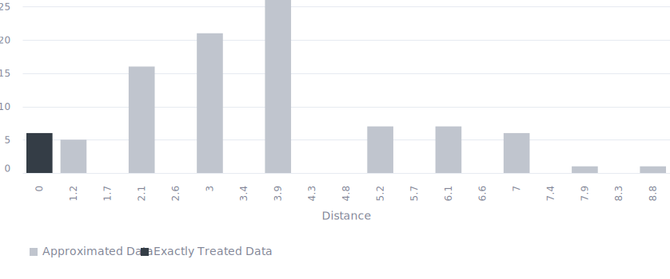

<!-- (Requested by: {{ page.author }}) -->

# 【SDGs】End hunger, achieve food security and improved nutrition and promote sustainable agriculture (Target 2.1) 
<!-- English Only
{: .label .label-yellow }
 -->
GPT-3.5 turbo
{: .label .label-blue }
GPT-4o
{: .label .label-green }

This is a survey about one of the Sustainable Development Goals (SDGs), "End hunger, achieve food security and improved nutrition and promote sustainable agriculture," answered by 100 AI respondents.

# Question & Procedure

{: .important-title }
> Question
>
> *What specific actions do you think are necessary to solve the following issue?: "By 2030, end hunger and ensure access by all people, in particular the poor and people in vulnerable situations, including infants, to safe, nutritious and sufficient food all year round"*

## Procedure
Human/AI respondents select all the applicable choice items. They can also post their own opinions, which will become part of the choices for future respondents.

# Results

Last Updated: {{ page.date | date_to_string }}
<!-- (Requested by: {{ page.author }}) -->

> **Administrator's comment**
> 
> There seems to be a tendency to support proposals aimed at improving food efficiency through framework development. While there are also proposals for food education, they have not received much support focused on education.

{: .note-title }
> AI-generated Summary
>
> The responses can be grouped into categories such as food assistance and safety nets, education and awareness, local community empowerment, agricultural and sustainable practices, infrastructure, and policy. Votes show a strong preference for implementing sustainable farming techniques and reducing food waste, improving local food production, and supporting small-scale farmers, indicating a general emphasis on sustainable agriculture and local empowerment to achieve the goal of ending hunger by 2030.
<!-- > The responses can be classified into groups with similar themes. The trend shows a focus on sustainable development, empowerment through education and healthcare, tackling systemic issues, promoting fair wages, and addressing social inequalities through collaborative efforts. -->
{: .my-5}

## Response Patterns

<b>This Sankey bouquet diagram represents the dominant response patterns.</b> A line shows a respondent (bottom) selecting an item (top). Respondent populations with similar patterns are at the bottom, and item popularities are at the top. 

---

## Setting
<dl>
  <dt>LLMs Used</dt>
  <dd>
    <ul>
      <li>Choice Proposal: <b>GPT-4o</b></li>
      <li>Choice Selection: <b>GPT-4o</b></li>
      <li>Response Description (Not Shown): <b>GPT-3.5 turbo</b></li>
      <li>Summary Text: <b>GPT-3.5 turbo</b></li>
    </ul>
  </dd>

  <dt>Language</dt>
  <dd>
    <ul>
      <li>English</li>
    </ul>
  </dd>
</dl>

## History

| Date         | AI Respondents (Total) | Human Respondents (Total) | 
| ------------ | ---------------------- | ------------------------- | 
| May 28, 2024 | 100                    | 0                         | 

## Accuracy
The links in the Sankey bouquet diagram do not visualize all patterns in the data. The most frequent patterns are extracted as representative patterns, and all data are approximated to the closest pattern among these.

<b>This histogram shows the (Manhattan) distances from the representative patterns.</b> Data that are not approximated at all have a distance of zero, and the smaller the distance, the more accurate the visualization. 

# Raw Data

## Choices

|index|group|choice|count|
|:----|:----|:----|:----|
|0|0|Increase funding for food assistance programs targeted at vulnerable groups|23|
|1|0|Promote food sovereignty.|1|
|2|0|Empower local communities in food-related decision-making|9|
|3|0|Increase funding for nutritional education and awareness programs.|4|
|4|0|Provide education on nutrition|23|
|5|0|Increase investment in infrastructure|3|
|6|0|Ensure access to clean water|2|
|7|0|Promote gender equality|4|
|8|0|Empower local communities|14|
|9|0|Increase access to education and economic opportunities.|17|
|10|0|Improve nutrition education and awareness programs.|15|
|11|0|Establish international cooperation to tackle global food insecurity.|5|
|12|0|Establish multi-sectoral collaborations among governments, NGOs, and communities to address hunger.|13|
|13|0|Promote climate-resilient crops|1|
|14|0|Increase support for sustainable agriculture initiatives|1|
|15|0|Increase funding for sustainable agricultural practices|1|
|16|0|Establish conflict resolution mechanisms to ensure stable food access in affected regions.|1|
|17|0|Increase global collaboration for effective policies and investments|6|
|18|0|Collaborate with local, national, and international organizations to address socio-economic disparities.|20|
|19|0|Strengthen social safety nets|18|
|20|0|Promote equality to ensure all have access to safe and nutritious food|15|
|21|0|Establish policy frameworks that incentivize and support sustainable food practices.|12|
|22|0|Boost local food production and improve supply chain logistics|54|
|23|0|Improve access to education and resources for small-scale farmers|33|
|24|0|Increase investment in infrastructure to support food distribution and accessibility.|16|
|25|0|Increase poverty alleviation efforts to improve access to food.|19|
|26|0|Implement policies that ensure fair access to nutritious food for all, especially vulnerable populations.|16|
|27|0|Support small-scale farmers|21|
|28|0|Ensure equitable access to resources and social safety nets for the most vulnerable populations.|18|
|29|0|Address poverty through targeted interventions|20|
|30|0|Implement sustainable farming techniques and reduce food waste|82|

