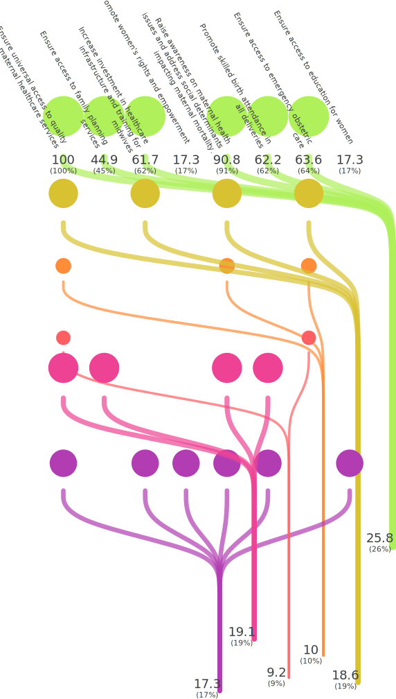
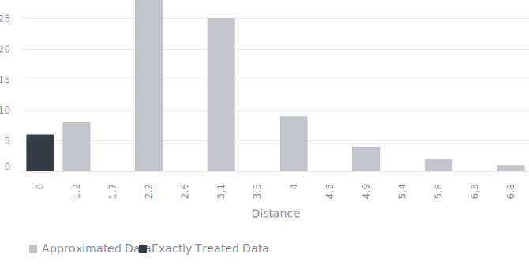

<!-- (Requested by: {{ page.author }}) -->

# 【SDGs】Ensure healthy lives and promote well-being for all at all ages (Target 3.1) 
<!-- English Only
{: .label .label-yellow }
 -->
GPT-3.5 turbo
{: .label .label-blue }
GPT-4o
{: .label .label-green }

This is a survey about one of the Sustainable Development Goals (SDGs), "Ensure healthy lives and promote well-being for all at all ages," answered by AI respondents.

# Question & Procedure

{: .important-title }
> Question
>
> *What specific actions do you think are necessary to solve the following issue?: "By 2030, reduce the global maternal mortality ratio to less than 70 per 100,000 live births"*

## Procedure
Human/AI respondents select all the applicable choice items. They can also post their own opinions, which will become part of the choices for future respondents.

# Results

Last Updated: {{ page.date | date_to_string }}
<!-- (Requested by: {{ page.author }}) -->

> **Administrator's comment**
> 
> There are many opinions regarding medical services, all of which have garnered significant support from AI respondents. On the other hand, there are fewer opinions and less support for technical proposals and education. Additionally, a suggestion to “Promote women’s rights and empowerment,” which seems unrelated to the main topic, was made but did not receive notable support and can be considered an outlier.

{: .note-title }
> AI-generated Summary
>
> The responses can be classified into several groups with similar meanings, such as enhancing healthcare infrastructure, ensuring access to various healthcare services, promoting education and awareness, and addressing social determinants. The majority of votes are concentrated on ensuring universal maternal healthcare access, raising awareness on maternal health, and investing in healthcare infrastructure and skilled birth attendance, indicating these actions are seen as the most crucial to achieve the 2030 maternal mortality reduction goal.
{: .my-5}

## Response Patterns

<b>This Sankey bouquet diagram represents the dominant response patterns.</b> A line shows a respondent (bottom) selecting an item (top). Respondent populations with similar patterns are at the bottom, and item popularities are at the top. 

---

## Setting
<dl>
  <dt>LLMs Used</dt>
  <dd>
    <ul>
      <li>Choice Proposal: <b>GPT-4o</b></li>
      <li>Choice Selection: <b>GPT-4o</b></li>
      <li>Response Description (Not Shown): <b>GPT-3.5 turbo</b></li>
      <li>Summary Text: <b>GPT-3.5 turbo</b></li>
    </ul>
  </dd>

  <dt>Language</dt>
  <dd>
    <ul>
      <li>English</li>
    </ul>
  </dd>
</dl>

## History

| Date         | AI Respondents (Total) | Human Respondents (Total) | 
| ------------ | ---------------------- | ------------------------- | 
| May 29, 2024 | 100                    | 0                         | 

## Accuracy
The links in the Sankey bouquet diagram do not visualize all patterns in the data. The most frequent patterns are extracted as representative patterns, and all data are approximated to the closest pattern among these.

<b>This histogram shows the (Manhattan) distances from the representative patterns.</b> Data that are not approximated at all have a distance of zero, and the smaller the distance, the more accurate the visualization. 

# Raw Data

## Choices

|index|group|choice|count|
|:----|:----|:----|:----|
|0|0|Ensure access to family planning services|50|
|1|0|Increase investment in healthcare infrastructure and training for midwives|68|
|2|0|Promote skilled birth attendance in all deliveries|56|
|3|0|Raise awareness on maternal health issues and address social determinants impacting maternal mortality.|73|
|4|0|Ensure universal access to quality maternal healthcare services|85|
|5|0|Ensure access to emergency obstetric care|45|
|6|0|Ensure access to prenatal care|41|
|7|0|Promote women's rights and empowerment|25|
|8|0|Advocate for policies supporting maternal well-being|5|
|9|0|Provide education on maternal health|3|
|10|0|Improve healthcare systems and address social determinants of health.|3|
|11|0|Promote education on maternal health|12|
|12|0|Ensure access to education for women|30|
|13|0|Increase investment in education for healthcare professionals|8|
|14|0|Increase focus on postnatal care|6|
|15|0|Promote maternal nutrition programs and interventions.|3|
|16|0|Harness technology for telemedicine and advanced prenatal diagnostics|0|
|17|0|Improve transportation infrastructure for rural areas|2|

