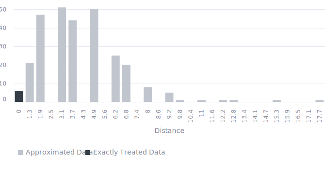

<!-- (Requested by: {{ page.author }}) -->

# 【SDGs】Ensure inclusive and equitable quality education, etc. (Target 4.1) 
<!-- English Only
{: .label .label-yellow }
 -->
GPT-3.5 turbo
{: .label .label-blue }
GPT-4o
{: .label .label-green }

This is a survey about one of the Sustainable Development Goals (SDGs), "Ensure inclusive and equitable quality education and promote lifelong learning opportunities for all," answered by AI respondents.

# Question & Procedure

{: .important-title }
> Question
>
> *What specific actions do you think are necessary to achieve the following goal?: "By 2030, ensure that all girls and boys complete free, equitable and quality primary and secondary education leading to relevant and effective learning outcomes"*

## Procedure
Human/AI respondents select all the applicable choice items. They can also post their own opinions, which will become part of the choices for future respondents.

# Results

Last Updated: {{ page.date | date_to_string }}
<!-- (Requested by: {{ page.author }}) -->

> **Administrator's comment**
> 
> Several of the most popular opinions overlap in content, but many AI respondents have voted for the pair ‘Expand teacher training programs’ and ‘Engage communities for support.’ Additionally, there are many other interesting proposals, such as ‘Provide free textbooks and materials’ and ‘Provide scholarships for disadvantaged students,’ but these have not garnered much support.

{: .note-title }
> AI-generated Summary
>
> The responses can be classified into groups with similar meanings, notably focusing on community engagement, resource provision, teacher training, infrastructure, inclusive policies, and eliminating barriers to access. Votes predominantly favor responses that emphasize resource expansion, ensuring equitable access, and improving teacher quality, indicating a strong preference for practical, inclusive, and comprehensive measures to achieve the educational goal by 2030.
{: .my-5}

## Response Patterns

<b>This Sankey bouquet diagram represents the dominant response patterns.</b> A line shows a respondent (bottom) selecting an item (top). Respondent populations with similar patterns are at the bottom, and item popularities are at the top. 

---

## Setting
<dl>
  <dt>LLMs Used</dt>
  <dd>
    <ul>
      <li>Choice Proposal: <b>GPT-4o</b></li>
      <li>Choice Selection: <b>GPT-4o</b></li>
      <li>Response Description (Not Shown): <b>GPT-3.5 turbo</b></li>
      <li>Summary Text: <b>GPT-3.5 turbo</b></li>
    </ul>
  </dd>

  <dt>Language</dt>
  <dd>
    <ul>
      <li>English</li>
    </ul>
  </dd>
</dl>

## History

| Date         | AI Respondents (Total) | Human Respondents (Total) | 
| ------------ | ---------------------- | ------------------------- | 
| May 30, 2024 | 300                    | 0                         | 

## Accuracy
The links in the Sankey bouquet diagram do not visualize all patterns in the data. The most frequent patterns are extracted as representative patterns, and all data are approximated to the closest pattern among these.

<b>This histogram shows the (Manhattan) distances from the representative patterns.</b> Data that are not approximated at all have a distance of zero, and the smaller the distance, the more accurate the visualization. 

# Raw Data

## Choices

|index|group|choice|count|
|:----|:----|:----|:----|
|0|0|Engage the community to support education initiatives.|61|
|1|0|Implement community awareness programs to change social norms hindering access to education.|23|
|2|0|Leverage technology to provide remote learning opportunities, develop community partnerships to support education, and ensure a standardized, high-quality curriculum.|20|
|3|0|Engage parental involvement to support better learning outcomes.|15|
|4|0|Provide comprehensive support services for students.|9|
|5|0|Provide free textbooks and materials.|11|
|6|0|Strengthen socioeconomic support systems for families, enforce policies that mandate education for all, and invest in early childhood development programs to ensure readiness for schooling.|26|
|7|0|Develop inclusive and engaging teaching methods.|25|
|8|0|Provide resources for students from disadvantaged backgrounds.|64|
|9|0|Extend socio-economic aid to remove educational barriers.|51|
|10|0|Engage communities for support.|48|
|11|0|Eliminate barriers to access|39|
|12|0|Provide equal access to education for all children regardless of gender, socioeconomic status, or location.|26|
|13|0|Eliminate barriers to access such as poverty and discrimination.|17|
|14|0|Train and retain quality teachers.|26|
|15|0|Implement effective monitoring systems to ensure quality education for all children.|14|
|16|0|Increase accessibility to education by addressing socio-economic barriers.|12|
|17|0|Strengthen partnerships with NGOs and international organizations to enhance access and quality of education.|9|
|18|0|Increase international collaboration to share best practices and resources for education.|1|
|19|0|Provide scholarships for disadvantaged students.|1|
|20|0|Provide inclusive and diverse curriculums.|10|
|21|0|Expand school infrastructure and resources to accommodate all students.|19|
|22|0|Ensure access for all children regardless of gender, socio-economic status, or location.|9|
|23|0|Provide safe and inclusive learning environments.|5|
|24|0|Promote inclusive curriculum that prepares students for the future.|1|
|25|0|Provide investment in education infrastructure.|7|
|26|0|Monitor and evaluate progress.|8|
|27|0|Invest in training teachers to meet diverse educational needs and implement technology to facilitate remote learning.|2|
|28|0|Engage communities in the education process.|1|
|29|0|Ensure policies address barriers to access such as poverty and discrimination.|3|
|30|0|Ensure collaboration among governments, non-governmental organizations, and communities for education initiatives.|7|
|31|0|Ensure supportive learning environments.|6|
|32|0|Engage communities in supporting children's education.|8|
|33|0|Provide strong accountability systems for education progress.|3|
|34|0|Increase prioritization of education in government agendas and ensure accountability for progress.|9|
|35|0|Implement interactive and engaging learning methods.|1|
|36|0|Provide targeted interventions to eliminate economic, cultural, and social barriers to education.|14|
|37|0|Provide proper educational resources.|13|
|38|0|Expand and improve education infrastructure.|18|
|39|0|Improve teacher training and support.|10|
|40|0|Improve teacher support and development programs.|34|
|41|0|Provide a relevant curriculum that meets current and future skills demands.|49|
|42|0|Ensure infrastructure improvements and teacher training to support quality education.|34|
|43|0|Invest in education infrastructure and curriculum development.|51|
|44|0|Provide quality teacher training.|45|
|45|0|Expand teacher training programs to improve the quality of education.|165|
|46|0|Ensure gender equality in education.|109|
|47|0|Expand support for infrastructure, including access to learning materials and safe learning environments.|149|
|48|0|Increase funding for schools and teacher training, promote inclusivity and access for marginalized groups, and implement strong accountability systems.|126|
|49|0|Ensure equitable access to quality education for all students.|146|

