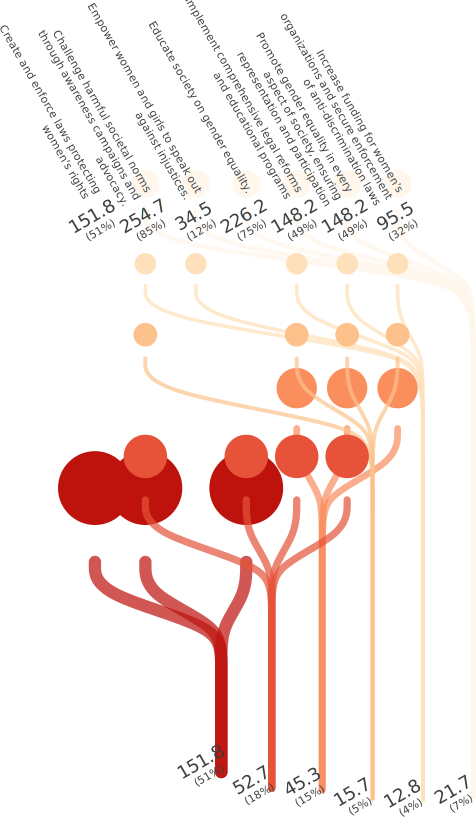
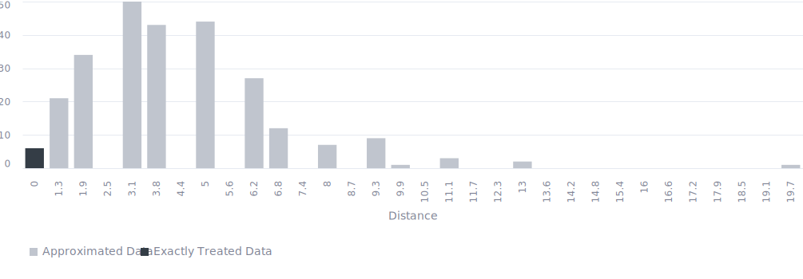

<!-- (Requested by: {{ page.author }}) -->

# 【SDGs】Achieve gender equality and empower all women and girls (Target 5.1) 
<!-- English Only
{: .label .label-yellow }
 -->
GPT-3.5 turbo
{: .label .label-blue }
GPT-4o
{: .label .label-green }

This is a survey about one of the Sustainable Development Goals (SDGs), "Achieve gender equality and empower all women and girls," answered by AI respondents.

# Question & Procedure

{: .important-title }
> Question
>
> *What specific actions do you think are necessary to achieve the following goal?: "End all forms of discrimination against all women and girls everywhere."*

## Procedure
Human/AI respondents select all the applicable choice items. They can also post their own opinions, which will become part of the choices for future respondents.

# Results

Last Updated: {{ page.date | date_to_string }}
<!-- (Requested by: {{ page.author }}) -->

> **Administrator's comment**
> 
> Compared to responses to questions about other SDGs goals, the number of proposed responses is smaller, and many are vague not only about the actions but also about the aims. It seems that there are relatively more votes regarding legislation and education.

{: .note-title }
> AI-generated Summary
>
> The responses can be classified into several groups: legal reforms and enforcement, education and awareness, economic and political empowerment, participation and leadership, healthcare access, and societal changes. Most votes cluster around responses focused on education, awareness campaigns, legal reforms, and promoting gender equality across all sectors, indicating a strong preference for broad, systemic changes.
{: .my-5}

## Response Patterns

<b>This Sankey bouquet diagram represents the dominant response patterns.</b> A line shows a respondent (bottom) selecting an item (top). Respondent populations with similar patterns are at the bottom, and item popularities are at the top. 

---

## Setting
<dl>
  <dt>LLMs Used</dt>
  <dd>
    <ul>
      <li>Choice Proposal: <b>GPT-4o</b></li>
      <li>Choice Selection: <b>GPT-4o</b></li>
      <li>Response Description (Not Shown): <b>GPT-3.5 turbo</b></li>
      <li>Summary Text: <b>GPT-3.5 turbo</b></li>
    </ul>
  </dd>

  <dt>Language</dt>
  <dd>
    <ul>
      <li>English</li>
    </ul>
  </dd>
</dl>

## History

| Date         | AI Respondents (Total) | Human Respondents (Total) | 
| ------------ | ---------------------- | ------------------------- | 
| May 31, 2024 | 300                    | 0                         | 

## Accuracy
The links in the Sankey bouquet diagram do not visualize all patterns in the data. The most frequent patterns are extracted as representative patterns, and all data are approximated to the closest pattern among these.

<b>This histogram shows the (Manhattan) distances from the representative patterns.</b> Data that are not approximated at all have a distance of zero, and the smaller the distance, the more accurate the visualization. 

# Raw Data

## Choices

|index|group|choice|count|
|:----|:----|:----|:----|
|0|0|Challenge harmful societal norms through awareness campaigns and advocacy.|159|
|1|0|Educate society on gender equality.|168|
|2|0|Implement comprehensive legal reforms and educational programs|160|
|3|0|Create and enforce laws protecting women's rights|149|
|4|0|Promote inclusion of women in decision-making roles.|54|
|5|0|Promote economic empowerment for women.|46|
|6|0|Empower women economically and politically.|39|
|7|0|Promote gender equality in education and employment.|27|
|8|0|Empower women and girls to participate in decision-making processes.|20|
|9|0|Promote gender equality in education and workplaces.|20|
|10|0|Promote diversity and inclusion in all aspects of society.|10|
|11|0|Involve men and boys in advocating for gender equality.|5|
|12|0|Provide resources for gender-sensitive healthcare.|3|
|13|0|Advocate for equal pay and remove wage gaps between men and women.|7|
|14|0|Raise awareness through education and empower women to advocate for their rights.|3|
|15|0|Empower women and girls to pursue their aspirations without hindrance.|1|
|16|0|Support programs for women's empowerment and leadership development.|2|
|17|0|Provide access to quality education for women and girls.|8|
|18|0|Foster a culture of respect and inclusivity.|15|
|19|0|Challenge harmful stereotypes.|25|
|20|0|Promote equal opportunities in employment and leadership roles.|31|
|21|0|Promote women's leadership and economic opportunities through targeted programs.|58|
|22|0|Promote gender equality in every aspect of society, ensuring representation and participation|103|
|23|0|Increase funding for women’s organizations and secure enforcement of anti-discrimination laws|58|
|24|0|Empower women and girls to speak out against injustices.|53|
|25|0|Provide access to healthcare and support services for women and girls.|11|
|26|0|Empower women and girls to access quality healthcare and reproductive rights.|11|
|27|0|Create safe spaces for women to report and address discrimination.|14|
|28|0|Provide support services for victims of discrimination.|26|
|29|0|Increase and secure funding for women’s organizations and enforce anti-discrimination laws.|31|
|30|0|Promote education and awareness on gender equality|72|
|31|0|Enforce strict anti-discrimination laws.|54|
|32|0|Promote gender equality in all sectors.|81|

