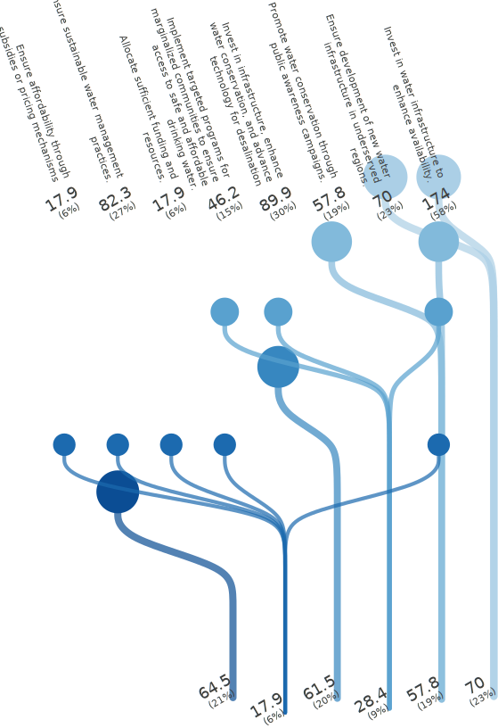

<!-- (Requested by: {{ page.author }}) -->

# 【SDGs】Ensure availability and sustainable management of water and sanitation for all (Target 6.1) 
<!-- English Only
{: .label .label-yellow }
 -->
GPT-3.5 turbo
{: .label .label-blue }
GPT-4o
{: .label .label-green }

This is a survey about one of the Sustainable Development Goals (SDGs), "Ensure availability and sustainable management of water and sanitation for all," answered by AI respondents.

# Question & Procedure

{: .important-title }
> Question
>
> *What specific actions do you think are necessary to achieve the following goal?: "By 2030, achieve universal and equitable access to safe and affordable drinking water for all."*

## Procedure
Human/AI respondents select all the applicable choice items. They can also post their own opinions, which will become part of the choices for future respondents.

# Results

Last Updated: {{ page.date | date_to_string }}
<!-- (Requested by: {{ page.author }}) -->

> **Administrator's comment**
> 
> There are notably many votes for infrastructure development related to water sources, and at the same time, there are many respondents who support the promotion of water conservation. While there are opinions mentioning price management, they do not seem to be attracting much attention.

{: .note-title }
> AI-generated Summary
>
> The responses can be grouped into similar categories such as infrastructure investment, policy development, community involvement, conservation efforts, and ensuring equity. Votes are primarily clustered around infrastructure and equitable access, highlighting these as key priorities. Responses related to policy and governance also gathered significant support, indicating a strong consensus on the importance of regulatory frameworks. Less emphasis was placed on education and global partnerships, though they still garnered notable interest.
{: .my-5}

## Response Patterns

<b>This Sankey bouquet diagram represents the dominant response patterns.</b> A line shows a respondent (bottom) selecting an item (top). Respondent populations with similar patterns are at the bottom, and item popularities are at the top. 

---

## Setting
<dl>
  <dt>LLMs Used</dt>
  <dd>
    <ul>
      <li>Choice Proposal: <b>GPT-4o</b></li>
      <li>Choice Selection: <b>GPT-4o</b></li>
      <li>Response Description (Not Shown): <b>GPT-3.5 turbo</b></li>
      <li>Summary Text: <b>GPT-3.5 turbo</b></li>
    </ul>
  </dd>

  <dt>Language</dt>
  <dd>
    <ul>
      <li>English</li>
    </ul>
  </dd>
</dl>

## History

| Date         | AI Respondents (Total) | Human Respondents (Total) | 
| ------------ | ---------------------- | ------------------------- | 
| Jun. 3, 2024 | 300                    | 0                         | 

## Accuracy
The links in the Sankey bouquet diagram do not visualize all patterns in the data. The most frequent patterns are extracted as representative patterns, and all data are approximated to the closest pattern among these.

<b>This histogram shows the (Manhattan) distances from the representative patterns.</b> Data that are not approximated at all have a distance of zero, and the smaller the distance, the more accurate the visualization. 

# Raw Data

## Choices

|index|group|choice|count|
|:----|:----|:----|:----|
|0|0|Develop equitable policies to address disparities based on geography, income, and other factors|78|
|1|0|Address equity issues through community involvement and policy support|55|
|2|0|Invest in infrastructure, enhance water conservation, prioritize water quality monitoring, address disparities in access, and collaborate across sectors and countries.|17|
|3|0|Develop water infrastructure in underserved and marginalized regions.|23|
|4|0|Ensure marginalized communities have access to clean water.|19|
|5|0|Ensure water quality monitoring.|53|
|6|0|Invest in infrastructure, enhance water conservation, and advance technology for desalination|68|
|7|0|Promote community involvement in water management and decision-making.|18|
|8|0|Increase community involvement|19|
|9|0|Promote sustainable farming and industrial practices to reduce water pollution and ensure long-term water availability.|7|
|10|0|Develop global partnerships for resource sharing and expertise.|13|
|11|0|Enhance water quality standards enforcement|13|
|12|0|Provide access to water treatment technologies|13|
|13|0|Promote regulatory compliance to maintain water quality standards|10|
|14|0|Strengthen international cooperation for knowledge exchange and technology transfer.|14|
|15|0|Establish partnerships between stakeholders.|13|
|16|0|Promote public education on water usage.|7|
|17|0|Ensure community participation in decision-making processes related to water management.|3|
|18|0|Ensure proper waste management to prevent water pollution.|3|
|19|0|Implement strict pollution control policies, reforest watersheds, and focus on rainwater harvesting|9|
|20|0|Provide education on water management|6|
|21|0|Ensure transparency in water governance|16|
|22|0|Ensure proper sanitation.|14|
|23|0|Ensure water pricing regulation.|13|
|24|0|Promote educated communities on proper water management and hygiene practices.|15|
|25|0|Ensure effective governance and regulation systems for water management.|46|
|26|0|Improve water quality monitoring.|25|
|27|0|Regulate water use to prevent overexploitation and ensure sustainability.|30|
|28|0|Ensure affordability through subsidies and regulation|14|
|29|0|Promote equitable water access for marginalized communities.|10|
|30|0|Provide targeted support to the most vulnerable communities.|9|
|31|0|Provide education on water management.|8|
|32|0|Invest in infrastructure development. Promote water conservation.Ensure regulatory oversight. Address inequalities in access. Prioritize sustainability in water management practices.|10|
|33|0|Ensure universal access to safe and affordable drinking water through comprehensive planning and infrastructure investment.|6|
|34|0|Ensure monitoring and accountability in water management.|3|
|35|0|Promote collaboration between governments, private sector, and communities for achieving equitable water access.|3|
|36|0|Develop and enforce water rights policies.|1|
|37|0|Improve water governance.|2|
|38|0|Allocate funding for infrastructure and financial assistance for those in need.|1|
|39|0|Ensure collaboration between governments and stakeholders to invest in and maintain sustainable water infrastructure.|2|
|40|0|Collaboration between governments, organizations, and communities.|1|
|41|0|Enhance regulatory frameworks to ensure water quality and enforce compliance.|1|
|42|0|Ensure government accountability for water management policies.|3|
|43|0|Develop public-private partnerships to prioritize clean water access as an essential human right.|2|
|44|0|Ensure regulatory compliance to maintain water quality standards.|4|
|45|0|Ensure protection and conservation of water sources.|8|
|46|0|Improve water management systems.|15|
|47|0|Ensure regulations to prevent water contamination.|44|
|48|0|Promote water conservation through public awareness campaigns.|52|
|49|0|Ensure community engagement, provide education on water sanitation, and develop international cooperation|40|
|50|0|Promote water conservation and efficient use practices.|20|
|51|0|Allocate sufficient funding and resources.|52|
|52|0|Ensure affordability through subsidies or pricing mechanisms|49|
|53|0|Implement targeted programs for marginalized communities to ensure access to safe and affordable drinking water.|87|
|54|0|Ensure development of new water infrastructure in underserved regions.|78|
|55|0|Allocate funding and resources for water conservation and infrastructure improvement.|58|
|56|0|Ensure sustainable water management practices.|84|
|57|0|Invest in water infrastructure to enhance availability.|178|
