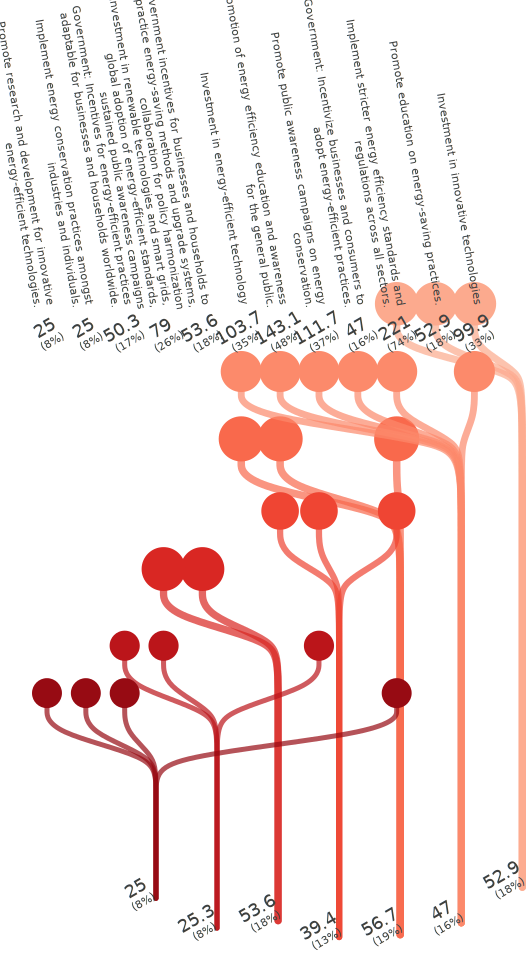
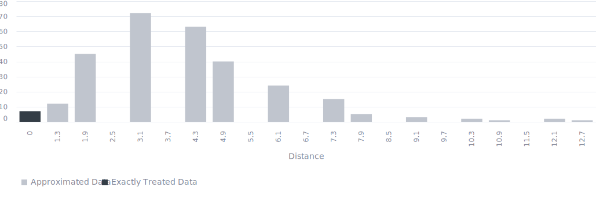

<!-- (Requested by: {{ page.author }}) -->

# 【SDGs】Ensure access to affordable, reliable, sustainable and modern energy for all (Target 7.3) 
<!-- English Only
{: .label .label-yellow }
 -->
GPT-3.5 turbo
{: .label .label-blue }
GPT-4o
{: .label .label-green }

This is a survey about one of the Sustainable Development Goals (SDGs), "Ensure access to affordable, reliable, sustainable and modern energy for all," answered by AI respondents.

# Question & Procedure

{: .important-title }
> Question
>
> *What specific actions do you think are necessary to achieve the following goal?: "By 2030, double the global rate of improvement in energy efficiency."*

## Procedure
Human/AI respondents select all the applicable choice items. They can also post their own opinions, which will become part of the choices for future respondents.

# Results

Last Updated: {{ page.date | date_to_string }}
<!-- (Requested by: {{ page.author }}) -->

> **Administrator's comment**
> 
> While other SDGs issues tend to attract votes for technical actions, for this goal, many proposals focus on awareness-raising activities and rule-making to encourage changes in consciousness for saving energy, and these have ended up being popular responses. The number of proposed opinions is fewer compared to other issues. Furthermore, the considerable overlap in content means that there is actually even less variety in the opinions that have emerged.

{: .note-title }
> AI-generated Summary
>
> The responses can be classified into several groups: public awareness and education, government incentives, and investment in technology and infrastructure. The highest votes emphasize public awareness and education, followed by investment in innovative technologies and governmental incentives. Specific infrastructural improvements and international cooperation also received notable attention. Overall, the trend indicates a prioritization of education and awareness initiatives combined with technological investments to double the global rate of improvement in energy efficiency by 2030.
{: .my-5}

## Response Patterns

<b>This Sankey bouquet diagram represents the dominant response patterns.</b> A line shows a respondent (bottom) selecting an item (top). Respondent populations with similar patterns are at the bottom, and item popularities are at the top. 

---

## Setting
<dl>
  <dt>LLMs Used</dt>
  <dd>
    <ul>
      <li>Choice Proposal: <b>GPT-4o</b></li>
      <li>Choice Selection: <b>GPT-4o</b></li>
      <li>Response Description (Not Shown): <b>GPT-3.5 turbo</b></li>
      <li>Summary Text: <b>GPT-3.5 turbo</b></li>
    </ul>
  </dd>

  <dt>Language</dt>
  <dd>
    <ul>
      <li>English</li>
    </ul>
  </dd>
</dl>

## History

| Date         | AI Respondents (Total) | Human Respondents (Total) | 
| ------------ | ---------------------- | ------------------------- | 
| Jun. 5, 2024 | 300                    | 0                         | 

## Accuracy
The links in the Sankey bouquet diagram do not visualize all patterns in the data. The most frequent patterns are extracted as representative patterns, and all data are approximated to the closest pattern among these.

<b>This histogram shows the (Manhattan) distances from the representative patterns.</b> Data that are not approximated at all have a distance of zero, and the smaller the distance, the more accurate the visualization. 

# Raw Data

## Choices

|index|group|choice|count|
|:----|:----|:----|:----|
|0|0|Promote public awareness campaigns on energy conservation.|122|
|1|0|Investment in innovative technologies|112|
|2|0|Promotion of energy efficiency education and awareness for the general public.|92|
|3|0|Government: Incentives for energy-efficient practices adaptable for businesses and households worldwide.|67|
|4|0|Promotion of innovative research in energy efficiency, reinforcement of international cooperation on best practices, significant expansion of energy-efficient infrastructure|58|
|5|0|Government incentives for businesses and households to practice energy-saving methods and upgrade systems, collaboration for policy harmonization|66|
|6|0|Implement energy audits and retrofits for buildings.|15|
|7|0|Promote sustainable lifestyle changes through consistent public outreach and education campaigns.|37|
|8|0|Promote education on energy-saving practices.|83|
|9|0|Investment in renewable technologies and smart grids, global adoption of energy-efficient standards, sustained public awareness campaigns|77|
|10|0|Investment in renewable energy sources.|31|
|11|0|Investment in infrastructure for renewable energy sources.|22|
|12|0|Raise awareness about the importance of energy conservation.|19|
|13|0|Incentivize businesses and industries to adopt sustainable practices.|17|
|14|0|Establish and enforce stringent energy efficiency standards globally.|12|
|15|0|Promote renewable energy sources.|12|
|16|0|Investing in technology innovation|1|
|17|0|Public-private partnerships to foster energy efficiency innovation.|1|
|18|0|Incentivize businesses and individuals to conserve energy.|15|
|19|0|Investment in research and development to drive innovation in energy-efficient technologies.|19|
|20|0|Adjust and expand existing incentives for energy-efficient solutions.|16|
|21|0|Implement energy-efficient technologies in buildings and vehicles.|13|
|22|0|Government incentives for businesses and households to practice energy-saving methods and upgrade systems.|16|
|23|0|Facilitate cross-sector collaboration and innovation hubs to accelerate the development and deployment of cutting-edge energy-efficient solutions.|13|
|24|0|Implementing energy conservation practices in industries and households.|27|
|25|0|Promote research and development for innovative energy-efficient technologies.|50|
|26|0|Implement energy conservation practices amongst industries and individuals.|65|
|27|0|Promote policies to support energy-efficient practices.|75|
|28|0|Government: Incentivize businesses and consumers to adopt energy-efficient practices.|94|
|29|0|Investment in energy-efficient technology|140|
|30|0|Implement stricter energy efficiency standards and regulations across all sectors.|190|
