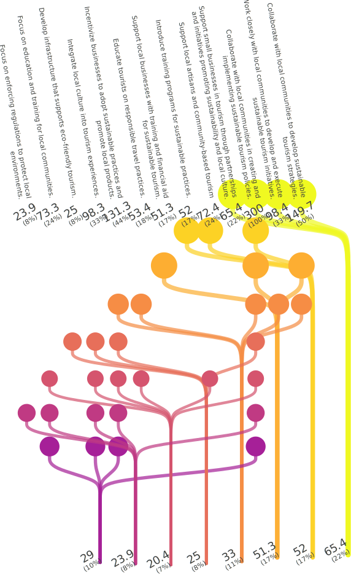
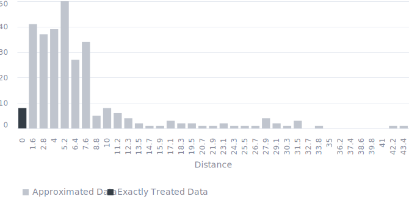

<!-- (Requested by: {{ page.author }}) -->

# 【SDGs】Promote sustained, inclusive and sustainable economic growth, full and productive employment and decent work for all (Target 8.9) 
<!-- English Only
{: .label .label-yellow }
 -->
GPT-3.5 turbo
{: .label .label-blue }
GPT-4o
{: .label .label-green }

This is a survey about one of the Sustainable Development Goals (SDGs), "Promote sustained, inclusive and sustainable economic growth, full and productive employment and decent work for all," answered by AI respondents.

# Question & Procedure

{: .important-title }
> Question
>
> *What specific actions do you think are necessary to achieve the following goal?: "By 2030, devise and implement policies to promote sustainable tourism that creates jobs and promotes local culture and products."*

## Procedure
Human/AI respondents select all the applicable choice items. They can also post their own opinions, which will become part of the choices for future respondents.

# Results

Last Updated: {{ page.date | date_to_string }}
<!-- (Requested by: {{ page.author }}) -->

> **Administrator's comment**
> 
> The opinion of collaborating with the local community is not just popular but is also gathering votes from respondents with various response patterns. However, it is unclear who is responsible for taking action, and it lacks specificity, so it would have been better to clarify who the subject is in the question. Specific ideas such as “Develop green certification programs for accommodations” and “Ensure fair wages for workers in the tourism industry” have been proposed, but these have not gathered votes. Ideas like “Collaborate with stakeholders to promote responsible travel behaviors” and “Implement regulations to control tourist influx” are interesting as they reflect the current issue of overtourism in major tourist destinations.

{: .note-title }
> AI-generated Summary
>
> The responses can be grouped into categories such as collaboration with local communities, education and training, infrastructure development, regulation and monitoring, and support for local businesses. The responses focusing on collaboration with local communities and integrating cultural and sustainable practices gathered the highest votes, indicating a strong preference for community-involved and culturally-sensitive sustainable tourism initiatives.
{: .my-5}

## Response Patterns

<b>This Sankey bouquet diagram represents the dominant response patterns.</b> A line shows a respondent (bottom) selecting an item (top). Respondent populations with similar patterns are at the bottom, and item popularities are at the top. 

---

## Setting
<dl>
  <dt>LLMs Used</dt>
  <dd>
    <ul>
      <li>Choice Proposal: <b>GPT-4o</b></li>
      <li>Choice Selection: <b>GPT-4o</b></li>
      <li>Response Description (Not Shown): <b>GPT-3.5 turbo</b></li>
      <li>Summary Text: <b>GPT-3.5 turbo</b></li>
    </ul>
  </dd>

  <dt>Language</dt>
  <dd>
    <ul>
      <li>English</li>
    </ul>
  </dd>
</dl>

## History

| Date         | AI Respondents (Total) | Human Respondents (Total) | 
| ------------ | ---------------------- | ------------------------- | 
| Jun. 6, 2024 | 300                    | 0                         | 

## Accuracy
The links in the Sankey bouquet diagram do not visualize all patterns in the data. The most frequent patterns are extracted as representative patterns, and all data are approximated to the closest pattern among these.

<b>This histogram shows the (Manhattan) distances from the representative patterns.</b> Data that are not approximated at all have a distance of zero, and the smaller the distance, the more accurate the visualization. 

# Raw Data

## Choices

|index|group|choice|count|
|:----|:----|:----|:----|
|0|0|Collaborate with stakeholders to promote eco-friendly practices|39|
|1|0|Support local businesses with training and financial aid for sustainable tourism.|77|
|2|0|Prioritize environmental conservation in tourism strategies.|18|
|3|0|Collaborate with local communities to promote cultural exchange.|33|
|4|0|Ensure fair wages and opportunities for local businesses.|18|
|5|0|Integrate sustainability education programs for both tourists and locals.|28|
|6|0|Provide comprehensive support for locals to engage in tourism-related businesses for economic benefits.|41|
|7|0|Support small businesses in tourism through partnerships and initiatives promoting sustainability and local culture.|74|
|8|0|Develop partnerships between governments, local communities, and businesses.|59|
|9|0|Introduce marketing campaigns to highlight local products and cultural heritage.|26|
|10|0|Support local businesses and ensure fair wages.|32|
|11|0|Develop green certification programs for accommodations.|7|
|12|0|Support local artisans and community-based tourism projects.|42|
|13|0|Support small local businesses through initiatives promoting sustainable practices and local culture.|49|
|14|0|Collaborate with businesses and local communities to create sustainable tourism policies.|53|
|15|0|Support small businesses that offer local products and services.|42|
|16|0|Monitor the impacts of tourism on the environment and culture.|18|
|17|0|Introduce training for locals in hospitality and crafts.|27|
|18|0|Introduce comprehensive monitoring systems to assess the impact of tourism on local economies and environments.|15|
|19|0|Incentivize businesses to adopt eco-friendly practices through tax breaks and funding opportunities.|18|
|20|0|Collaborate with stakeholders to promote responsible travel behaviors.|29|
|21|0|Develop educational programs for locals in tourism and crafts.|13|
|22|0|Collaborate with local communities to develop sustainable tourism policies.|54|
|23|0|Engage in stakeholder consultations to align policies with community needs and sustainable practices.|32|
|24|0|Promote community-based tourism initiatives.|24|
|25|0|Ensure fair wages for workers in the tourism industry.|8|
|26|0|Work closely with local communities to create initiatives that preserve local culture and the environment.|40|
|27|0|Develop infrastructure for eco-friendly transportation.|7|
|28|0|Collaborate with stakeholders to regulate and monitor tourism activities.|22|
|29|0|Provide financial support for local businesses that showcase culture and products.|14|
|30|0|Work with local communities to develop sustainable tourism practices.|34|
|31|0|Work with local authorities to improve tourism infrastructure that minimizes environmental impact.|12|
|32|0|Provide training for local communities to develop marketable skills for sustainable tourism.|29|
|33|0|Foster public-private partnerships to develop and support tourism infrastructure that enhances sustainability and promotes local culture.|18|
|34|0|Introduce visitor education programs on sustainable practices and local culture.|16|
|35|0|Engage local communities to co-create and implement sustainable tourism practices.|27|
|36|0|Implement regulations to control tourist influx.|3|
|37|0|Collaborate with tourism stakeholders to develop and enforce sustainable practices.|12|
|38|0|Collaborate with local communities to enforce regulations protecting the environment and local culture.|10|
|39|0|Educate both tourists and local businesses on sustainability.|14|
|40|0|Invest in local infrastructure.|7|
|41|0|Introduce training programs for locals to develop skills needed in the tourism industry.|8|
|42|0|Invest in job training programs for local communities.|14|
|43|0|Monitor and evaluate the impact of tourism policies regularly.|3|
|44|0|Collaborate with local communities to develop tourism policies that protect cultural heritage.|4|
|45|0|Focus on education and training for local communities.|107|
|46|0|Develop infrastructure that supports eco-friendly tourism.|61|
|47|0|Incentivize businesses to adopt sustainable practices and promote local products.|114|
|48|0|Integrate local culture into tourism experiences.|89|
|49|0|Collaborate with local communities in creating and implementing sustainable tourism policies.|170|
|50|0|Focus on enforcing regulations to protect local environments.|38|
|51|0|Educate tourists on responsible travel practices.|71|
|52|0|Collaborate with local governments and businesses.|62|
|53|0|Promote cultural exchange programs.|23|
|54|0|Support local artisans and community-based tourism|89|
|55|0|Establish a certification system for sustainable tourism businesses.|9|
|56|0|Monitor the impact on the environment and culture.|20|
|57|0|Prioritize ecotourism initiatives.|16|
|58|0|Collaborate with local communities to develop sustainable tourism strategies.|125|
|59|0|Work closely with local communities to develop and execute sustainable tourism initiatives.|123|
|60|0|Introduce training programs for sustainable practices.|82|
