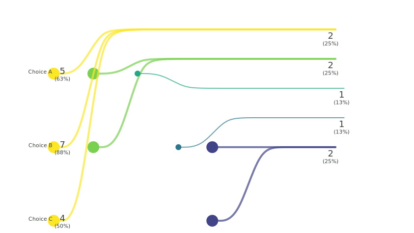
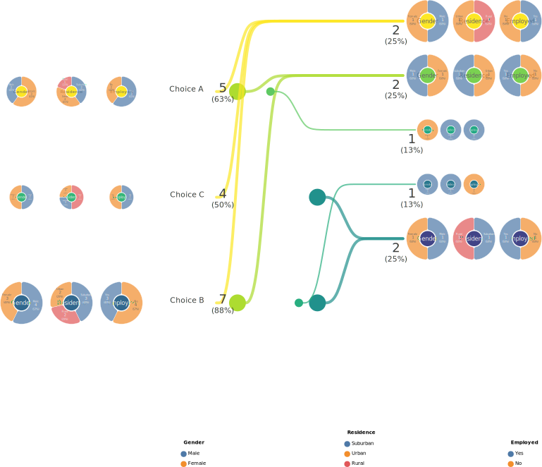
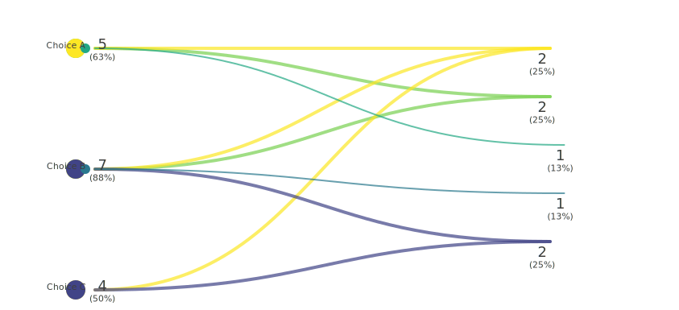

# Bouquet Diagrams

To visualize the results of response patterns, we use the Sankey bouquet diagram.

## What is it?
It is a simple yet effective visualization method we developed for better interpretability of binary relational data (also known as bipartite networks).

Suppose you have a response pattern dataset from a survey. 
The left and right elements respectively represent the choice items and respondents, and a pair of elements are connected by a link (curved line) if a respondent selected a choice item. 

The weight (number of duplicates) of each response pattern is indicated at one end of the link and also reflected in the link thickness (though not necessarily linearly). 
The popularity of each choice is also indicated.

When respondents have attributes, the distribution of these attributes is indicated using pie charts.

## Why Do We Need It?
### Better Interpretability Than a Standard Network Diagram
A straightforward network plot of the response patterns would look like the following:

While this is intuitive, the interpretability quickly deteriorates as the data size increases.
This is mainly due to the enormous number of link crossings and overlaps. 

While there have been many attempts to improve the interpretability of network data, the Sankey bouquet diagram utilizes the edge bundling technique as a basic strategy. It not only bundles the links from the same respondent node but also optimizes the node orderings and shifts the location of the choice nodes to avoid link crossings. Moreover, shifting the global offset of the nodes is effective in avoiding link overlap.

### Approximation In Large Dataset
However, when there are too many distinct response patterns, and you try to draw all of them, the diagram will inevitably look cluttered.

In that case, a few of the most frequent response patterns are selected as representative patterns, and all response patterns are approximated to one of these representative patterns. The Manhattan distance is employed as the measure of closeness. For a response pattern having multiple representative patterns with the shortest distance, respondents with such a response pattern are evenly distributed among those representative patterns; this implies that the weight of each response pattern is not always an integer.