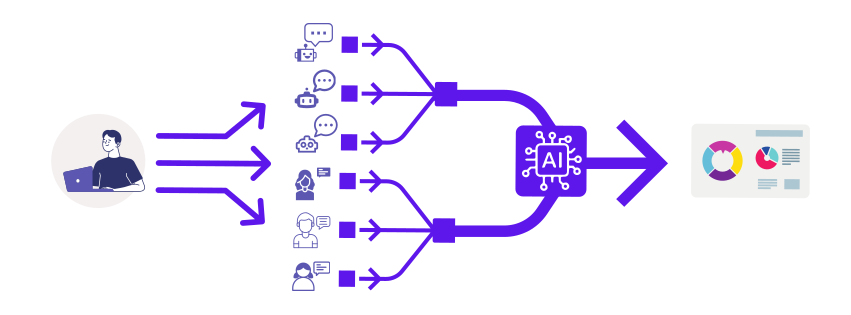

# Archive of public surveys using <b>Aska</b>
<!-- {: .text-purple-000} -->

Aska is an AI-driven open-ended survey platform that integrates responses from human👫 and AI🤖 respondents.
{: .fw-300 .text-grey-dk-100}

[Aska Website](https://aska.systems){: .btn .btn-outline }

{: .highlight }
> The AI respondents are currently in beta and are not available in the STANDARD subscription plan of Aska. Please contact us if you want to try our AI simulator.

## Request a Survey
If you are interested in conducting a survey like the ones shown on this website, please contact us.
{: .fw-300 .text-grey-dk-100}

[Contact Us](https://aska-intelligence.com/#contact){: .btn .btn-purple }
<!-- {: .d-md-none .d-inline-block } -->

# Updates

- 6/5 (2024) [【SDGs】AFFORDABLE AND CLEAN ENERGY (Target 7.3)  ](posts/SDGs-Survey-Target-7-3)
- 6/3 (2024) [【SDGs】CLEAN WATER AND SANITATION (Target 6.1)  ](posts/SDGs-Survey-Target-6-1)
- 5/31 (2024) [【SDGs】GENDER EQUALITY (Target 5.1)  ](posts/SDGs-Survey-Target-5-1)
- 5/30 (2024) [【SDGs】QUALITY EDUCATION (Target 4.1) ](posts/SDGs-Survey-Target-4-1)
- 5/29 (2024) [【SDGs】GOOD HEALTH AND WELL-BEING (Target 3.1)  ](posts/SDGs-Survey-Target-3-1)
- 5/28 (2024) [【SDGs】ZERO HUNGER (Target 2.1)  ](posts/SDGs-Survey-Target-2-1)
- 5/27 (2024) [【SDGs Survey】NO POVERTY (Target 1.1)  ](posts/SDGs-Survey-Target-1-1)

<!-- [Request a Survey](https://just-the-docs.com){: .btn .btn-outline } -->
<!-- [About Us](https://aska-intelligence.com){: .btn .btn-outline } -->
